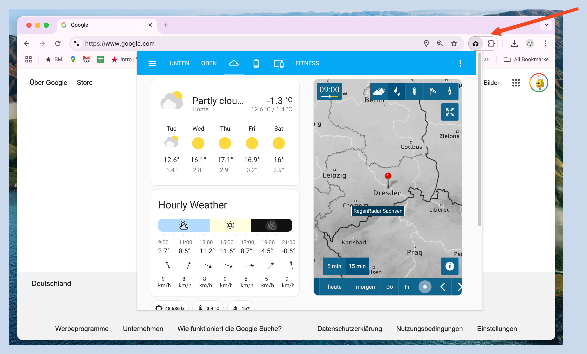
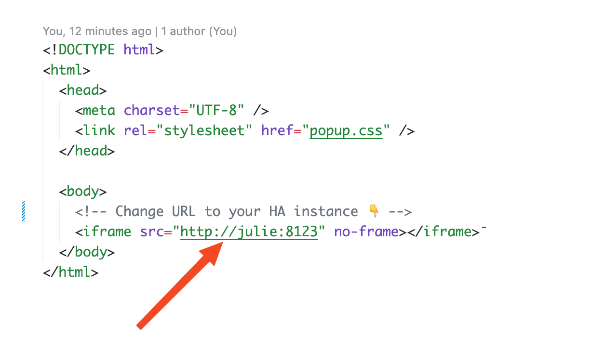
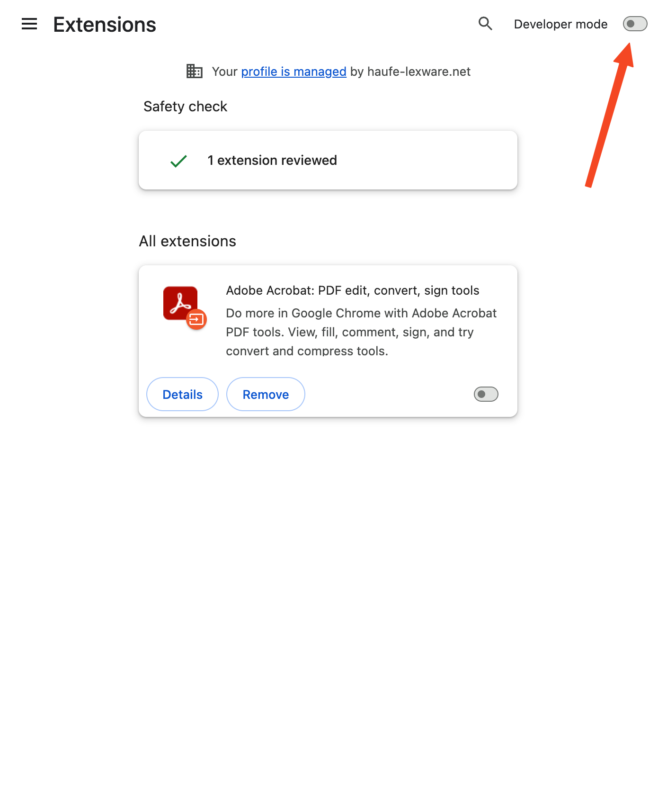
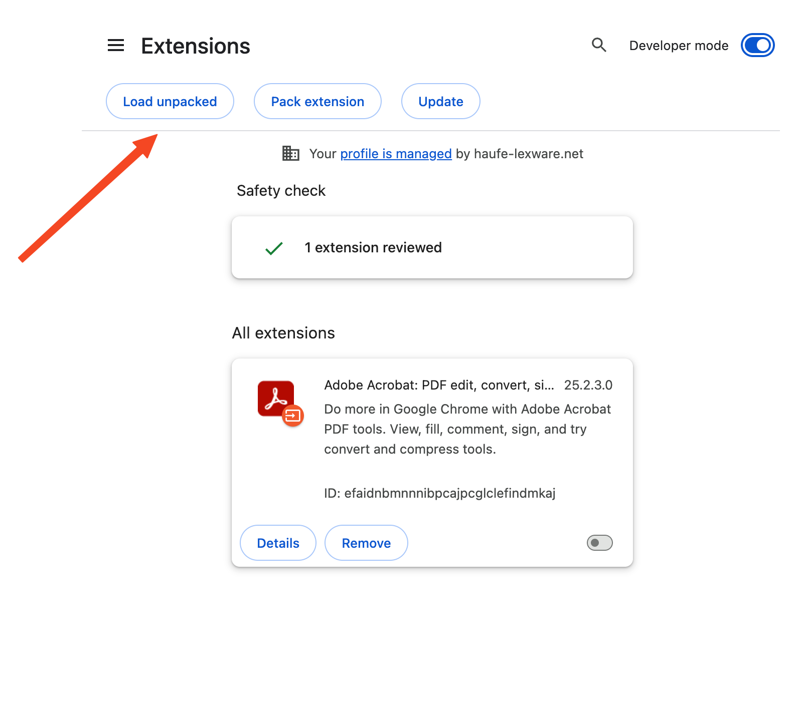
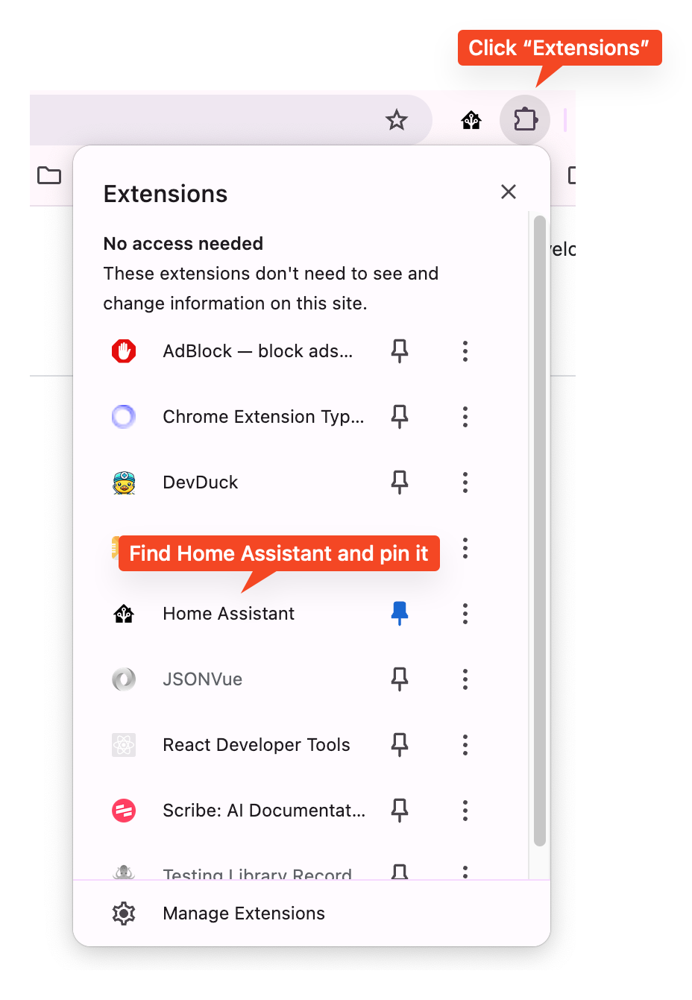

# Home Assistant Chrome Extension

This Chrome extension provides easy and fast access to your Home Assistant dashboard by displaying it in a popup window. It allows you to quickly open your Home Assistant dashboard, making it convenient to monitor and control your smart home devices.



# Installation

### Download and extract the extension

Download the chrome extension from github:

https://github.com/uwinkler/chrome-ha/archive/refs/heads/main.zip

### Adjust URL

Edit `popup.html` and change the URL of the iframe. It should point to your Home Assistant server.



### Configure HA

In Home Assistance, add this following line to your `configuration.yml`:

```yml
http:
  use_x_frame_options: false
```

Otherwise HA will not be shown in the iframe. Restart your HA server

### Load and unpack the extension

1. Go to `chrome://extensions`

2. Enable development mode



3. Click "Load unpacked"



4. Find you extension and pin it

   

### That's it 🥳
